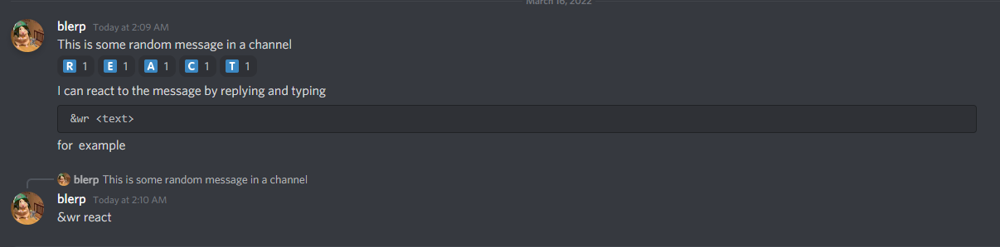

# React-Bot

This bot has two main functions :

- A "That's what she said" replier, thing which replies that what she said to certain sentences. I've set this to run for every 1 in X messages cuz I don't want it to be too annoying. But that can be changes by the env variable TWSS_CHANCE. If its not specified it default to 1 in 10.
- A message reaction bot to react to messages with some text. An example is shown below.


## To run:

You'll need some libraries to run this, so install them using 

```bash
$ pip install requirements.txt
```

You'll also need to set two environment variables

- ```BLAZE_BOT_TOKEN``` : The discord bot token 
- ```TWSS_CHANCE``` : an integer value `X`, which gives the bot a  `1 in X` chance to reply `That's what she said`.

You can then locally run the bot by running

```bash
$ python BlazeBot.py
```